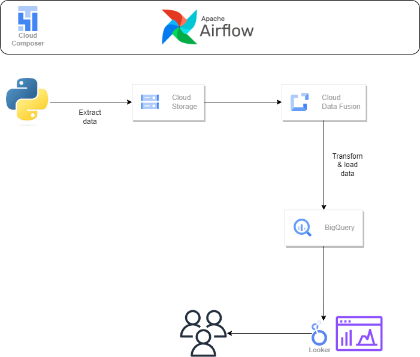

# GCP Data Engineering Project – Employee Dataset

*This project was completed as a self-learning exercise by following an online tutorial,
aiming to develop practical skills in data engineering on Google Cloud Platform.*

## Overview
This project implements an end-to-end ETL (Extract, Transform, Load) data pipeline on Google Cloud Platform (GCP).
The pipeline extracts raw data using Python, applies data transformation and masking using Cloud Data Fusion, and loads the processed data into Google BigQuery.
Workflow orchestration handled using Apache Airflow (Cloud Composer).

## Services I Used
- Python – data extraction
- Google Cloud Storage (GCS) – raw data storage
- Cloud Data Fusion – data transformation, masking, and encoding
- Apache Airflow (Cloud Composer) – pipeline orchestration
- Google BigQuery – data warehousing and analytics

## What I Built
1. Uploaded raw CSV and JSON datasets to Amazon S3
2. Converted JSON files to Parquet using AWS Lambda
3. Processed CSV files using AWS Glue ETL jobs (PySpark)
4. Joined multiple datasets using AWS Glue
5. Queried transformed data using Amazon Athena

## Data Pipeline Workflow
1. Data Extraction
    - Raw data is extracted using a Python script
    - Extracted data is stored in Google Cloud Storage
2. Data Transformation & Masking
    - Cloud Data Fusion is used to:
        - Clean and transform the data
        - Apply data masking and encoding to sensitive fields
    - Transformed data is prepared for analytics
3. Data Loading
    - The transformed data is loaded into Google BigQuery tables
    - Data is optimized for querying and analysis

4. Orchestration
    - Apache Airflow (Cloud Composer)
    - DAGs manage task dependencies and scheduling

### Pipeline Summary
- **Source:** Mock employee data generated using a Python script and stored in Google Cloud Storage (CSV format)
- **Transform:** Data cleansing, transformation, and masking of sensitive fields performed using Google Cloud Data
- **Target:** Transformed and masked data loaded into Google BigQuery tables for analytics and querying

## Dataset Used
Mock-Data from Python script

## Architecture Diagram

## Airflow
